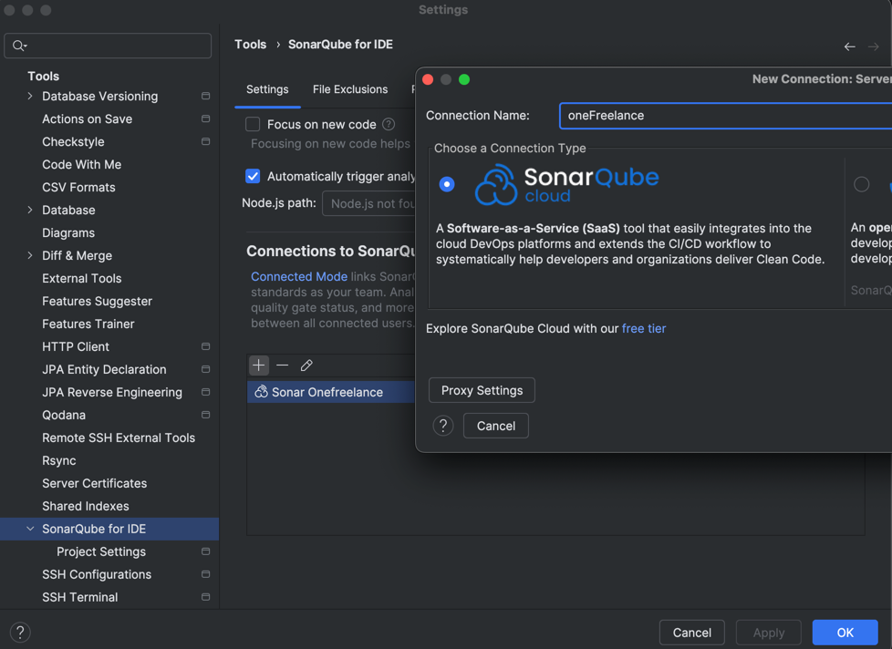
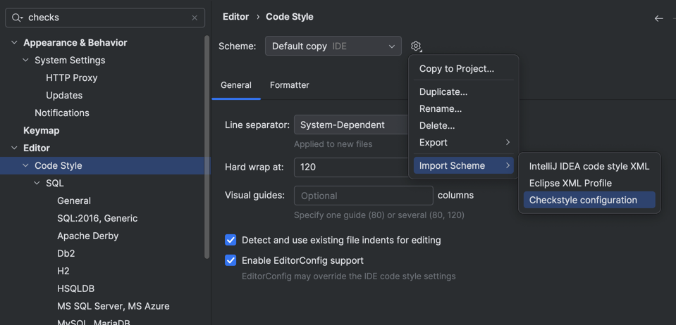
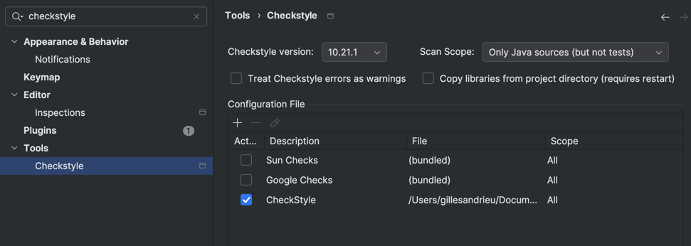
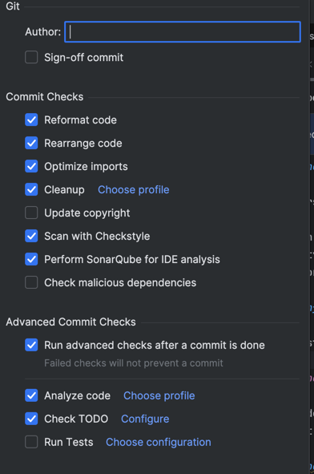

<!-- START doctoc generated TOC please keep comment here to allow auto update -->
<!-- DON'T EDIT THIS SECTION, INSTEAD RE-RUN doctoc TO UPDATE -->
**Table of Contents**  *generated with [DocToc](https://github.com/thlorenz/doctoc)*

- [How to install SonarQube IDE plugin on Intellij and connect it to sonarcloud.io](#how-to-install-sonarlint-plugin-on-intellij-and-connect-it-to-sonarcloudio)
- [How to install CheckStyle plugin on Intellij](#how-to-install-checkstyle-plugin-on-intellij)
- [How to perform Sonar / Checkstyle before each commit on Intellij](#how-to-perform-sonar--checkstyle-before-each-commit-on-intellij)

<!-- END doctoc generated TOC please keep comment here to allow auto update -->

## How to install SonarQube IDE plugin on Intellij and connect it to sonarcloud.io

1. Install SonarQube IDE plugin in Preferences -> Plugin
2. In SonarQube IDE tab, configure as follow :

   Project settings - Configure the connection
   

   A token will be asked, you can create it from *create Token* button that will redirect you to sonarcloud.io security
   page.

## How to install CheckStyle plugin on Intellij

1. Import code style scheme to be used later on **Save Actions plugin** as follow :
   

   Import the one from /.github/linters/sun_checks.yml (notice here that we will use **Google checkstyle** but we have
   no choice for the actual **SuperLinter github plugin** to name it sun_checks.xml -> hardcoded config filename.)

2. Install Checkstyle - IDEA plugin in Preferences -> Plugin
3. Go to Preferences - Tools - Checkstyle
4. Add new configuration file and import it from the same path as point 1.

Now you should be able to see a Checkstyle tab, just select **active configuration** from the Rules drop down list.

## How to perform Sonar / Checkstyle before each commit on Intellij

1. CMD + K to open Commit changes window
2. Configure as described in the right block "Before Commit" :

